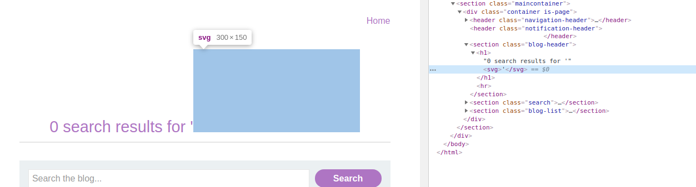

*Note: Before we begin, go do the lab yourself. At least attempt it! You learn so many more things that way by struggling with a problem than jumping straight to the answer. Don't make the mistake I did when I was first starting out as an infosec infant, okay?*

[Link to PortSwigger Web Academy](https://portswigger.net/web-security)

[Link to the lab: Reflected XSS with some SVG markup allowed](https://portswigger.net/web-security/cross-site-scripting/contexts/lab-some-svg-markup-allowed)

```
Lab description:
This lab has a simple reflected XSS vulnerability. The site is blocking common tags but misses some SVG tags and events.

To solve the lab, perform a cross-site scripting attack that calls the alert() function.
```


Like many of the XSS challenges in this CTF, there's a search bar that takes user input. And remember, when there's user input, there's evil afoot. 


We know (according to the lab description) that the site blocks "common tags" but some SVG tags and events are free game. Now it's just a matter of finding out what SVG tags and events we can use. 

Tags like `<h1>` and `p` are blocked. `<script>` tags are blocked too. 

However, `<svg>` tags aren't blocked. Note what happens when we try to insert an `<svg>` tag and inspect the source code of the result. 



We see that the `<svg>` tag is actually rendered, confirming that we need to do something that involves an svg tag in order for us to run our `alert()` function. 

Lots of people have already done a ton of the research for us, so one of my favorite links to look at when I'm doing some XSS evil is this [Cross-Site Scripting Cheatsheet](https://portswigger.net/web-security/cross-site-scripting/cheat-sheet) by PortSwigger. 

Combing through the cheatsheet, this input stands out to me in particular:
```
<svg onload=alert(1)>
```

Since "onload" is a common JavaScript event I doubt it will work, but it's worth a try. 

...Nope. I get an "Event is not allowed" error. 

Referring to [this Firefox page](https://developer.mozilla.org/en-US/docs/Web/SVG/Element/svg) about the SVG element, there a bunch of global events listed on the page. I've put them below for reference:

```
oncancel, oncanplay, oncanplaythrough, onchange, onclick, onclose, oncuechange, ondblclick, ondrag, ondragend, ondragenter, ondragexit, ondragleave, ondragover, ondragstart, ondrop, ondurationchange, onemptied, onended, onerror, onfocus, oninput, oninvalid, onkeydown, onkeypress, onkeyup, onload, onloadeddata, onloadedmetadata, onloadstart, onmousedown, onmouseenter, onmouseleave, onmousemove, onmouseout, onmouseover, onmouseup, onmousewheel, onpause, onplay, onplaying, onprogress, onratechange, onreset, onresize, onscroll, onseeked, onseeking, onselect, onshow, onstalled, onsubmit, onsuspend, ontimeupdate, ontoggle, onvolumechange, onwaiting

```

After trying a couple of them in the below format:
```
<svg [eventhere]>
```
I figure that the majority, if not all of these "global events" would be blocked, as "global" implies that just about any tag can use these JavaScript events. 

Interestingly, there are some "animation" tag attributes here:
```
onbegin, onend, onrepeat
```

So, I try the below input in the search bar: 
```
<svg onbegin="alert(1)">
```

And it passes through the filter, but I don't get the alert that I want. 

Additionally, there's an `<animate>` tag that is often used with `<svg>` elements (to animate your svg objects) - but upon trying to enter this tag into the search bar it's blocked. (Refer to [this tutorial](https://css-tricks.com/guide-svg-animations-smil/)). 

I know that from reading, the "onbegin" event DOES deal with animations, so I need to find an alternate tag that can be used for animations. 

[Wikipedia to the rescue!](https://en.wikipedia.org/wiki/SVG_animation) This code snippet on the article catches my eye, instead of an `<animate>` tag it uses an `<animateTransform>` tag... 

```
<svg onbegin="alert(1")>
<circle cx="0" cy="1" r="2" stroke="red" fill="none">
  <animateTransform
   attributeName="transform"
   attributeType="XML"
   type="rotate"
   from="0"
   to="360"
   begin="0s"
   dur="1s"
   repeatCount="indefinite"/>
 </circle>
```

Trying the above input, it gets through the filter and the circle actually renders a little bit, though it's really friggin small. 

So, I modified the code here to make the circle more visible (for funsies) and added my "onbegin" event with the "alert" function in it... 

[Click here for spoiler. Don't be a script kiddie!](https://gist.githubusercontent.com/webhackwaifu/4256c7fe2500276fcc4b849050266762/raw/0bc5a8424ebe4e592fadb76a2f50ba01314c9feb/spoiler1.txt)

I hope this was helpful!

Best,

Nen, webhackwaifu

### YouTube Video
[Coming soon]

### Cited Links
- [Link to PortSwigger Web Academy](https://portswigger.net/web-security)
- [Link to the lab: Reflected XSS with some SVG markup allowed](https://portswigger.net/web-security/cross-site-scripting/contexts/lab-some-svg-markup-allowed)
- [Firefox SVG Reference](https://developer.mozilla.org/en-US/docs/Web/SVG/Element/svg)
- [SVG Animation tutorial](https://css-tricks.com/guide-svg-animations-smil/)
- [SVG Animation Wikipedia article](https://en.wikipedia.org/wiki/SVG_animation)
